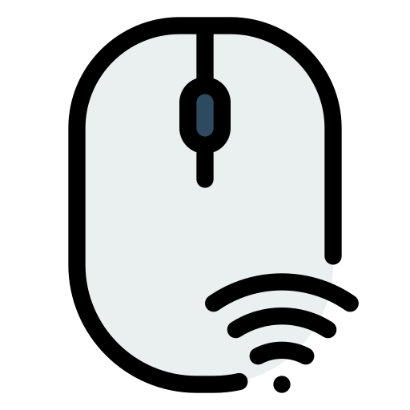

# Mobile Mouse

Turn your Android phone into a precise wireless touchpad and remote mouse for your laptop. This Flutter app streams touch gestures or native gyroscope motion over Wi-Fi to a lightweight desktop listener so you can control the cursor, perform clicks, and experiment with motion-driven interactions.



---

## ✨ Features

- **Dual input modes**
  - Touchpad surface with smooth drag-to-move gestures
  - Gyroscope streaming that converts phone orientation into pointer deltas
- **Click controls**: Dedicated left and right click buttons with icon states
- **Quick connect**: Enter your laptop IP/port and connect over TCP with status feedback
- **Modern UI**: Gradient splash screen, branded card layout, and responsive design
- **Cross-platform foundation**: Built with Flutter + `sensors_plus` for Android, iOS, desktop, and web targets

---

## 🧱 Architecture Overview

```mermaid
flowchart LR
    Phone[Flutter App]
    subgraph Flutter Layers
        UI[Touchpad & Controls]
        Controller[MouseController]
        TCP[TcpService]
    end
    Laptop[Desktop Listener]

    UI --> Controller --> TCP -->|JSON {gyroX, gyroY, leftClick}| Laptop
    UI -->|Clicks| Controller
    Gyro[Gyroscope Stream] --> Controller
```

- `MouseController` marshals touch or gyro data into JSON payloads (`gyroX`, `gyroY`, `leftClick`, `rightClick`).
- `TcpService` keeps a persistent socket connection to the desktop listener and logs every outbound payload.
- `GyroscopeEvents` (via `sensors_plus`) provide real-time motion data when gyro mode is toggled on.

---

## 🚀 Getting Started

### Prerequisites

- Flutter 3.9+ (Dart 3.9 SDK)
- Android Studio or VS Code with Flutter extension
- Physical Android device or emulator with motion sensors (gyro mode needs a real device)
- Desktop listener (Java/Python/etc.) running on the same Wi-Fi network and listening on TCP port 5000 by default

### Installation

```bash
# Clone the repo
 git clone https://github.com/gnyanarushi/mobile-mouse-mobile-app.git
 cd mobile-mouse-mobile-app

# Fetch dependencies
 flutter pub get

# Run on an Android device
 flutter run
```

---

## 📱 App Walkthrough

1. **Splash & Branding**
   - Animated gradient splash screen displays the logo and tagline.
2. **Connection Card**
   - Enter laptop IP & port (defaults to `10.5.5.10:5000`).
   - Tap **Connect** to open the TCP socket; status text updates (e.g., *Connected*, *Connection failed*).
3. **Control Modes**
   - **Touchpad Surface**: Drag anywhere inside the curved panel to emit pointer deltas.
   - **Gyro Mode**: Toggle *Use Gyroscope Control* to stream orientation data when connected.
4. **Clicks**
   - Left and right click buttons send discrete press events.

---

## 🖥️ Desktop Listener Expectations

- Listens on TCP `host:port` (default `0.0.0.0:5000`).
- Parses newline-delimited JSON with this schema:

```json
{"gyroX": -0.12, "gyroY": 0.08, "leftClick": false, "rightClick": false}
```

- `gyroX`/`gyroY`: Either drag deltas or gyroscope readings, depending on the active input mode.
- `leftClick`/`rightClick`: Fire OS-level mouse events when true.

> 🛠️ Example tooling: Java `Robot`, Python `pyautogui`, or Node `robotjs` can translate JSON into cursor moves + clicks.

---

## 🧪 Testing & Debugging

- Use Flutter’s **hot reload** for UI tweaks; restart after sensor or asset changes.
- Console logs show every JSON payload (`log] Sending payload: ...`) for quick verification.
- If you see `SocketException: Connection timed out`, double-check laptop firewall rules, IP, and that both devices share the same Wi-Fi.

---

## 📦 Project Structure

```
lib/
 ├─ main.dart                 # Splash, touchpad UI, connection logic
 ├─ controllers/
 │   └─ mouse_controller.dart # JSON payload formatting
 └─ services/
     ├─ tcp_service.dart      # Socket connect/send logic
     └─ gyro_service.dart     # (Optional) Stand-alone gyro stream wrapper
assets/
 └─ icon/icon.png             # App logo used in splash & header
```

---

## 📄 License

MIT License © 2025 [gnyanarushi](https://github.com/gnyanarushi)

---

## 🙌 Contributing

1. Fork the repo and create a feature branch.
2. Run `flutter format .` + `flutter analyze` before opening a PR.
3. Submit a pull request describing the change and testing steps.

Feedback, issues, and feature suggestions are always welcome! Open an issue if you’d like support integrating with your desktop listener or adding new gestures (scroll, double-tap, multi-touch, etc.).
